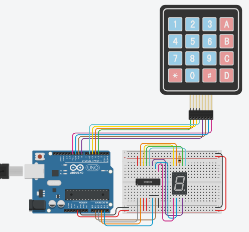

# KeyBin - Teclado Matricial com Saída Binária

Projeto Arduino que converte pressionamentos de teclas em sinais binários de 4 bits, ideal para controle de displays digitais ou interfaces simples.

[](https://jp-linux.github.io)

[](https://www.arduino.cc)




## 🔧 Funcionalidades
- Leitura de teclado matricial 4x4
- Conversão direta para sinal binário (4 bits)
- Mapeamento personalizável de teclas
- Saída para displays de 7 segmentos ou outros dispositivos digitais

## ⚙️ Esquema de Ligação
| Componente   | Pinos Arduino  |
|--------------|----------------|
| Linhas (ROW) | 3, 4, 5, 6     |
| Colunas (COL)| 8, 9, 10, 11   |
| Saída binária| A1, A2, A3, A4 |

## 🗺️ Mapeamento das Teclas
```
1  2  3  A  → [1, 2, 3, 10]
4  5  6  B  → [4, 5, 6, 11]
7  8  9  C  → [7, 8, 9, 12]
*  0  #  D  → [14, 0, 15, 13]
```

## 📦 Dependências
- Arduino IDE
- Placa Arduino UNO

## 🚀 Como Usar
1. Conecte o teclado conforme esquema acima
2. Carregue o código no Arduino
3. Os pinos A1-A4 apresentarão:
   - Sinal binário direto (A1 = LSB, A4 = MSB)
   - Valores de 0 a 15 conforme tecla pressionada

## 📎 Arquivos Incluídos
- `Teclado Matricial com Saída Binária.pdf`: Diagrama completo do circuito
- `projeto_01.png`: Layout de referência do teclado

## ✍️ Autor
**Jorge Paulo Santos**  
[](https://github.com/JP-Linux)  
✉️ jorgepsan7@gmail.com

## 💝 Suporte ao Projeto

Se este projeto foi útil para você, considere apoiar meu trabalho através do GitHub Sponsors:

[](https://github.com/sponsors/JP-Linux)


